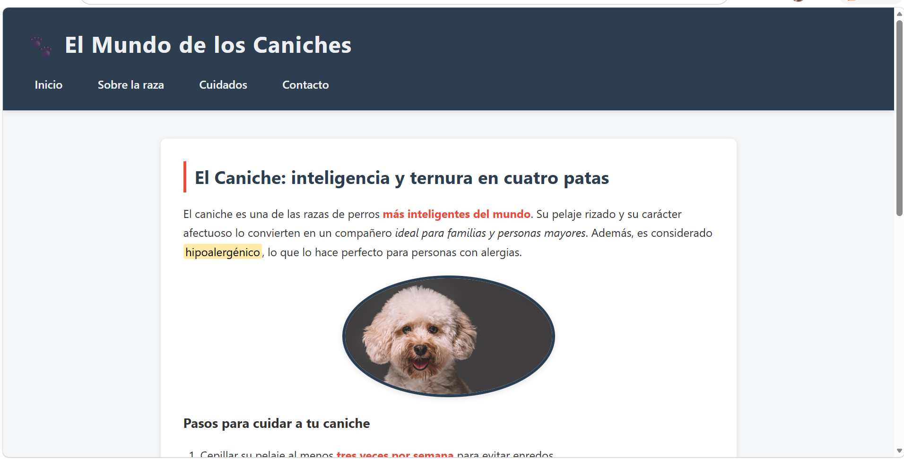

# tarea-1-utn
# 🐾 El Mundo de los Caniches

Proyecto desarrollado como entrega de la **Tarea - Módulo 1, Unidad 1** del curso *Antes de React* — Centro de e-Learning UTN BA.

## Créditos

| Campo | Detalle |
|---|---|
| **Autor** | Elizabeth Denett |
| **Curso** | Antes de React |
| **Módulo** | Módulo 1 |
| **Unidad** | Unidad 1 - Tarea 1|
| **Institución** | Centro de e-Learning UTN BA |

## Capturas de pantalla

### Vista principal




## Descripción

Página web estática con estructura HTML semántica y estilos CSS externos. Presenta información sobre la raza caniche, incluyendo un artículo con imagen, lista ordenada y un formulario de contacto.

## Cómo clonar y abrir el proyecto

```bash
git clone https://github.com/elizabethdenett/tarea-1-utn.git
cd tarea-1-utn
```

Luego abrí el archivo `index.html` directamente en tu navegador (doble clic o clic derecho → *Abrir con...*).

## Bibliografía

- Duckett, J. *HTML & CSS: Design and Build Websites*. John Wiley & Sons, 2011.
- MDN Web Docs. *HTML: HyperText Markup Language*. https://developer.mozilla.org/en-US/docs/Web/HTML
- MDN Web Docs. *CSS: Cascading Style Sheets*. https://developer.mozilla.org/en-US/docs/Web/CSS
- WHATWG. *HTML Living Standard* (2025). https://html.spec.whatwg.org/

### Herramientas y comunidades consultadas

- Stack Overflow. Comunidad de preguntas y respuestas para desarrolladores. Consultado durante el desarrollo para resolver dudas sobre selectores CSS y estructura HTML semántica. https://stackoverflow.com
- Anthropic. *Claude AI* — Asistente de inteligencia artificial utilizado como apoyo para la generación y revisión del código HTML/CSS del proyecto. https://claude.ai
